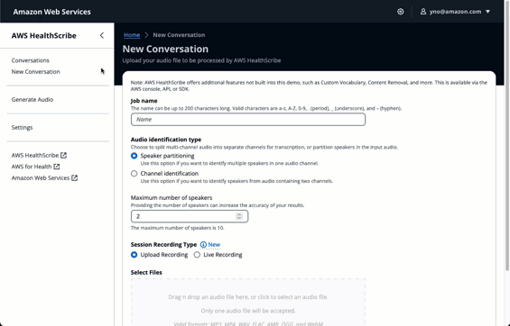
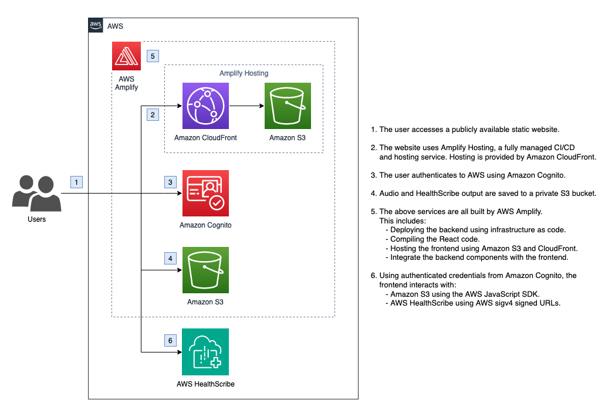

# AWS HealthScribe Demo

The AWS HealthScribe Demo app shows the art of the possible
with [AWS HealthScribe](https://aws.amazon.com/healthscribe/), a HIPAA-elgible service empowering healthcare software
vendors to build clinical applications that automatically generate clinical notes by analyzing patient-clinician
conversations.

After deploying the demo, you can record or submit audio files to AWS HealthScribe, view the status of the job, and
visualize the transcript and summarized clinical notes, including sections like complaint, history of present illness,
assessment, and treatment plan.

Additionally, structured medical terms extracted by AWS HealthScribe can be sent
to [Amazon Comprehend Medical](https://aws.amazon.com/comprehend/medical/) for ontology linking, allowing you to infer
ICD-10-CM, SNOMED CT, or RxNorm codes.

This project uses [AWS Amplify](https://aws.amazon.com/amplify/) to deploy a full-stack web application with an UI based
on [Cloudscape](https://cloudscape.design/), authentication using [Amazon Cognito](https://aws.amazon.com/cognito/) and
storage using [Amazon Simple Storage Service (S3)](https://aws.amazon.com/s3/).

<!-- TOC -->

-   [AWS HealthScribe Demo](#aws-healthscribe-demo)
    -   [Deployment](#deployment)
        -   [Automatic Deployment](#automatic-deployment)
        -   [Semi-Automatic Deployment via AWS CodeCommit](#semi-automatic-deployment-via-aws-codecommit)
    -   [Security Considerations](#security-considerations)
        -   [Disable User Sign Ups](#disable-user-sign-ups)
        -   [Encryption At Rest and In Transit](#encryption-at-rest-and-in-transit)
        -   [Access Logging](#access-logging)
    -   [Usage](#usage)
    -   [Architecture](#architecture)
    -   [Cleanup](#cleanup)
    -   [FAQ](#faq)
        -   [The public sample repo has been updated. How do I update my local deployment to the latest code?](#the-public-sample-repo-has-been-updated-how-do-i-update-my-local-deployment-to-the-latest-code)
        -   [Can I use this UI with existing AWS HealthScribe jobs?](#can-i-use-this-ui-with-existing-aws-healthscribe-jobs)
    -   [Security](#security)
    -   [License](#license)
    <!-- TOC -->

## Deployment

### Automatic Deployment

This method uses AWS Amplify hosting to build, deploy, and serve the web app. You must have a GitHub account.

-   Select the link above.
-   Ensure you are in a region where AWS HealthScribe is available. See the [AWS HealthScribe region table](https://aws.amazon.com/healthscribe/pricing/) for more information.
-   On the _Welcome to Amplify Hosting_ page, Select _Connect to GitHub_.
-   This redirects you to GitHub for authentication, after which you are redirected back to AWS Amplify.
-   In the _Select service role_ dropdown, select a service role that allows Amplify to deploy the app. If none exist,
    select _Create new role_ and follow the prompts.
-   Select _Save and deploy_.
    -   This repository will be forked to your GitHub account for deployment.
        See the FAQ for instructions on deploying this demo with a private repository.

_Note:_ if the deployment hangs on the _Forking your GitHub repository_ for more than a minute, refresh the page and
repeat the steps above.

### Semi-Automatic Deployment via AWS CodeCommit

See the [deployment guide](./docs/deploy.md) for semi-automatic steps.

## Security Considerations

_Note:_ this demo is provided as a sample, and not meant to be used in a production capacity. Please review your
organization's compliance requirements prior to uploading any data containing PHI.

### Disable User Sign Ups

By default, any user with a valid email can sign up and authenticate into the web app. To disable this feature, and add
users manually (or turn off sign ups after you have signed up),

-   Navigate to [Amazon Cognito](https://console.aws.amazon.com/cognito/v2/home) in the AWS console
-   Select the user pool for this web app. It should be named `healthScribeDemoAuthUserPool-<unique id>`.
-   Select the _Sign-up experience_ tab.
-   Scroll to the bottom to the _Self-service sign-up_ section, and select the _Edit_ button for this box.
-   Uncheck _Enable self-registration_.
-   Select _Save changes_.

### Encryption At Rest and In Transit

All traffic between the client (browser) and the server (AWS Amplify Hosting, AWS HealthScribe, Amazon S3) is encrypted
in transit. Audio files uploaded to S3 and AWS HealthScribe output JSON is encrypted at rest.

### Access Logging

Access logging is enabled for audio files and HealthScribe output in S3. These audit logs are written to a separate S3
bucket with a name starting with `amplify-awshealthscribedemo-loggingbucket`. Both buckets are retained when you delete
the app.

## Usage

Amplify deploys a public-accessible website. When you first visit the site, select the **Sign In** link at the top right
of the page. From there, select **Create Account** and fill in the required information. Once authenticated, you have
access to all features of this web app. Note that all conversations are viewable by any authenticated user.

## Architecture

## Cleanup

_Note:_ the S3 bucket containing audio files and HealthScribe output is retained during delete. The S3 bucket containing
access logs for the former is also retained during delete.

-   Navigate to the [AWS console for AWS Amplify](https://console.aws.amazon.com/amplify/home).
-   Select the web app.
-   On the top right, select _Actions_, then _Delete app_.

## FAQ

#### The public sample repo has been updated. How do I update my local deployment to the latest code?

During the initial deployment, AWS Amplify forked this repository to your GitHub account. Amplify then built a CI/CD
pipeline using your fork as the source.
To update your Amplify deployment, sync your fork with this repository:

1. Navigate to the fork in your GitHub account.
2. Select "Sync fork."
3. Select "Update branch."

#### Can I use this UI with existing AWS HealthScribe jobs?

Yes, but you will have to grant the Amazon Cognito identity pool's authenticated role access to the S3 bucket where the
input audio files and output JSON files are located.

1. Navigate to [Amazon Cognito Identy Pools](https://console.aws.amazon.com/cognito/v2/identity) in the AWS console.
   Make sure you are in the correct region.
2. Select the identity pool associated with the demo. It is named similar to `healthScribeDemoAuthIdentityPool..`
3. Select the "User access" tab.
4. Select the link under "Authenticated role." This will open a new tab to the IAM role assumed by authenticated users.
5. Add `s3:GetObject` actions for the S3 bucket(s) where your existing audio input and JSON output files are located.

#### Can I deploy this demo from a private repository?

Yes. Amplify Hosting supports connections to private repositories hosted on
public [GitHub, Bitbucket, and GitLab](https://docs.aws.amazon.com/amplify/latest/userguide/getting-started.html#step-1-connect-repository).

1. [Duplicate this repository](https://docs.github.com/en/repositories/creating-and-managing-repositories/duplicating-a-repository)
   to your private repository hosted on public GitHub, Bitbucket, or GitLab.
2. Use Amplify Hosting to [connect to your private repository](https://docs.aws.amazon.com/amplify/latest/userguide/getting-started.html#step-1-connect-repository).

Alternatively, you can use a private AWS CodeCommit repository with the [Semi-Automatic Deployment](#semi-automatic-deployment-via-aws-codecommit) method.

## Security

See [CONTRIBUTING](CONTRIBUTING.md#security-issue-notifications) for more information.

## License

This library is licensed under the MIT-0 License. See the LICENSE file.
